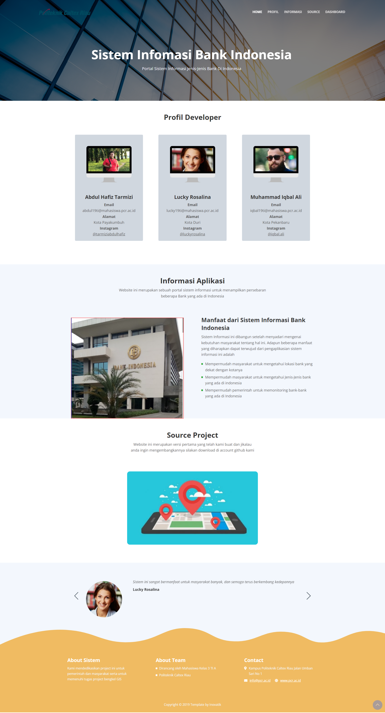
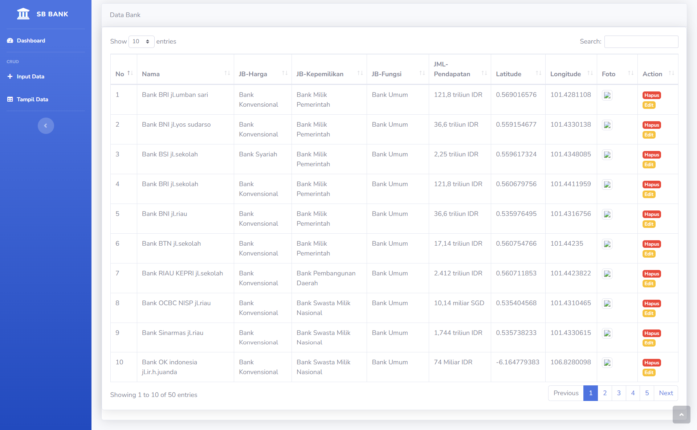

<p align="center"> </a> <a href="https://www.w3schools.com/css/" target="_blank" rel="noreferrer"></p>

<p align="center">
<a href="https://travis-ci.org/laravel/framework"></a>
<a href="https://packagist.org/packages/laravel/framework"></a>
<a href="https://packagist.org/packages/laravel/framework"></a>
<a href="https://packagist.org/packages/laravel/framework"></a>
</p>

# Sistem Informasi Bank Indonesia Berbasis GIS

Website GIS ini merupakan sebuah portal sistem informasi untuk menampilkan persebaran beberapa Bank yang ada di Indonesia.

## Fitur Utama

- **Pemetaan Data Bank Indonesia**: Sistem ini memanfaatkan teknologi Geographic Information System (GIS) dengan pemanfaatan Leaflet.js untuk memetakan data terkait Bank Indonesia.
- **Informasi Spesifik**: Tampilkan informasi spesifik terkait lokasi atau wilayah terkait Bank Indonesia, termasuk data penting, statistik, dan lainnya.
- **Framework Web CodeIgniter**: Memanfaatkan CodeIgniter sebagai basis pengembangan untuk sistem informasi, memberikan kestabilan dan kemudahan dalam pengelolaan.

## Teknologi yang Digunakan

- **Leaflet.js**: Menggunakan Leaflet.js sebagai pustaka pemetaan (mapping) utama untuk menampilkan data geografis terkait Bank Indonesia.
- **CodeIgniter**: Framework PHP yang handal dan mudah digunakan untuk pengembangan web, memberikan landasan yang solid untuk proyek ini.

## Instalasi

**Kloning Repositori Ini**
   ```bash
git clone https://github.com/abdulhafiztarmizi16/bank_ci.git
   ```
**Buka folder tersebut di Server Lokal**
   ```bash
http://localhost/bank_ci/
   ```
**NOTE**
- Jika map tidak muncul silakan perbarui acces token mapbox https://www.mapbox.com/

## Tampilan 
- Tampilan Homepage

- Tampilan databank


  


